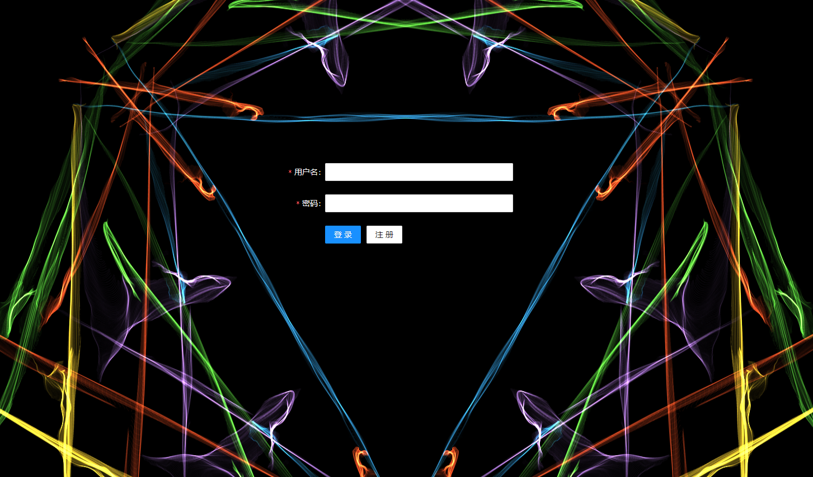
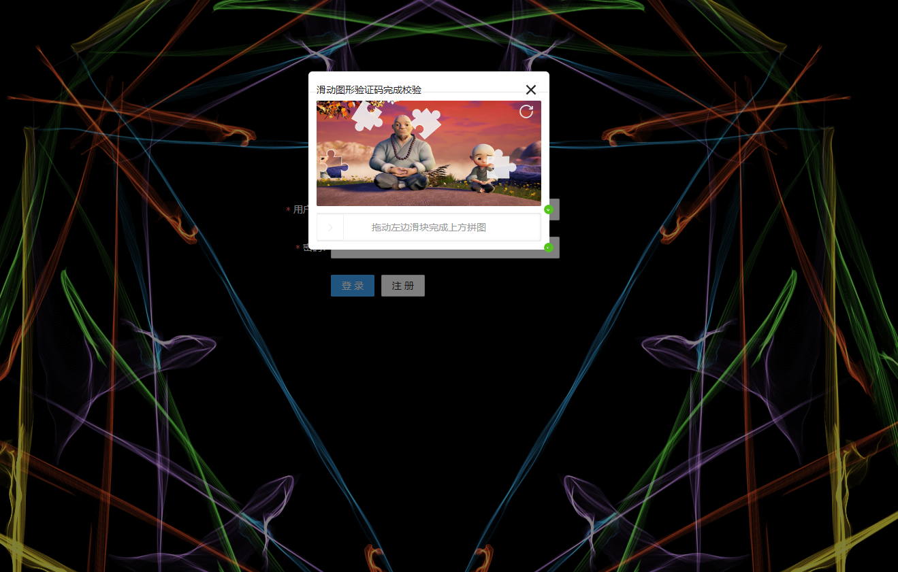
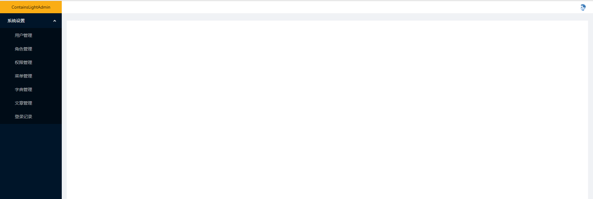
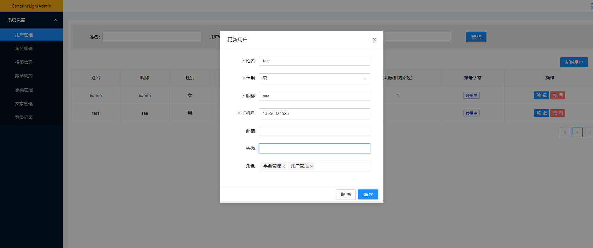
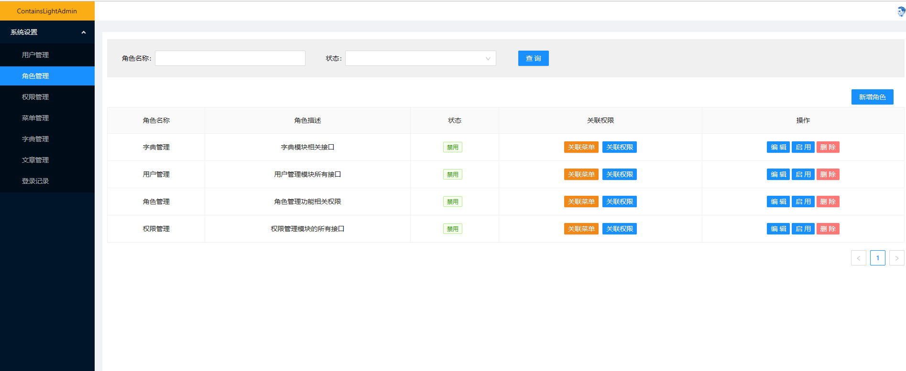
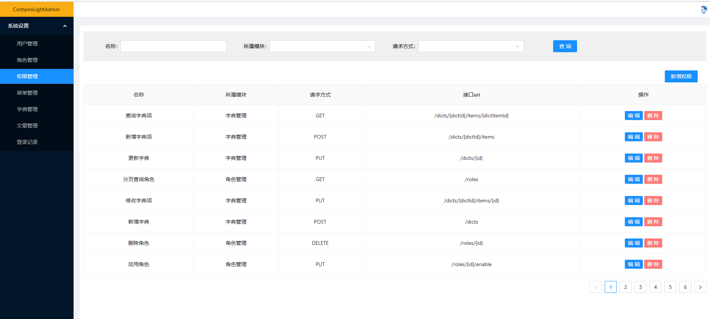
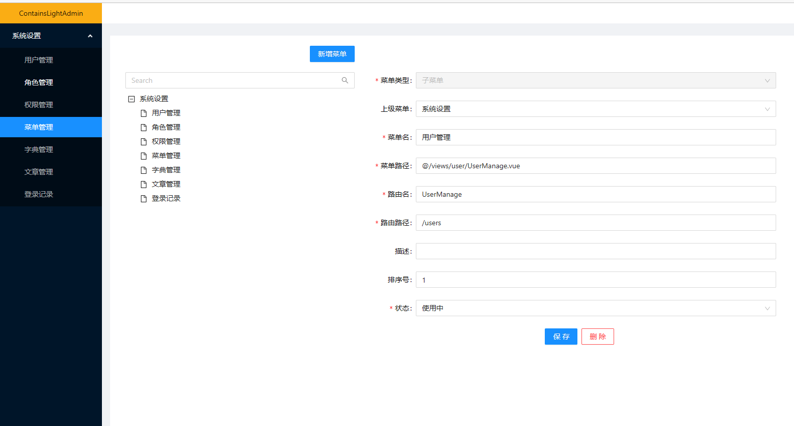
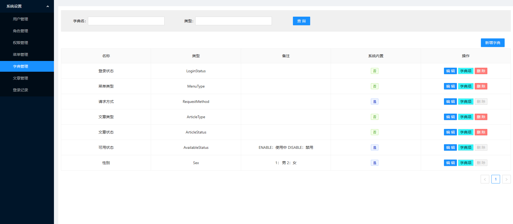
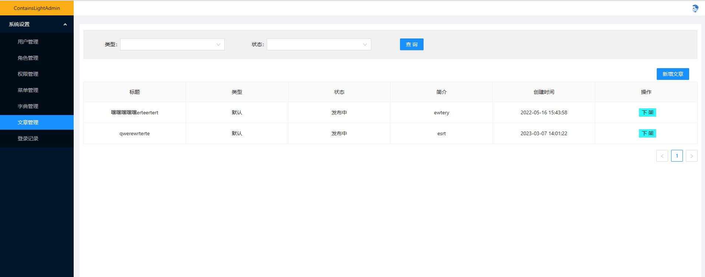
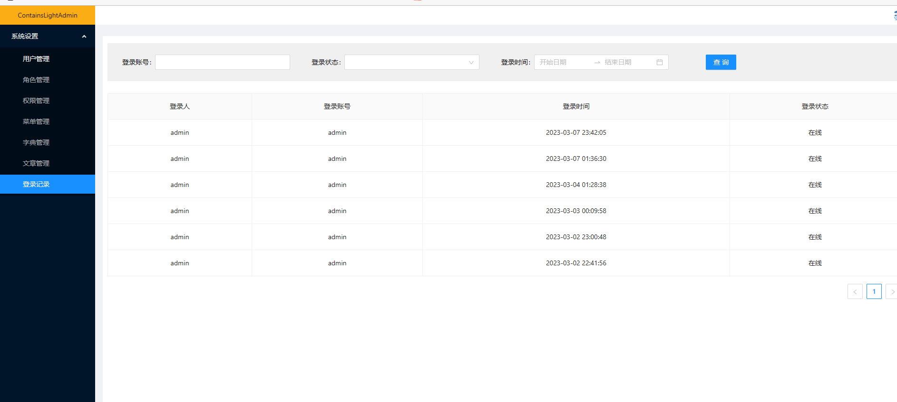

## 介绍

使用 Vue3 + ts + Fetch 搭建的后台管理系统。后台代码：https://github.com/NotEdibleSalt/ContainsLight

## 功能模块

- 用户管理
- 角色管理
- 权限管理
- 菜单管理
- 字典管理
- 文章管理
- 登录记录

## 运行

```
npm install

npm run serve
```

## 页面展示




















